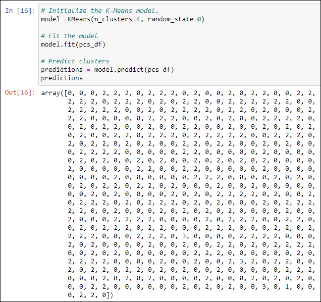

# Cryptocurrencies

## Project Overview

Using unsupervised machine learning to discover trends in cryptocurrency to assist in the development of a potential investment portfolio. This analysis will cover cryptocurrencies currently available on the trading market and how they could be grouped to create a classification system for the new investment.

## Resources

- Data: [Crypto Currency](Resources/crypto_data.csv)
- Software/Applications: Jupyter Notebook
- Languages/Libraries: Python 3.8.5, pandas, scikit-learn
- Vizulations: plotly express, hvplot

## Results

#### 1. Preprocess data for PCA

- [Line[3] - Line[12]](crypto_clustering.ipynb)

#### 2. Reducing Data Dimensions Using PCA

- [Line[13] - Line[14]](crypto_clustering.ipynb)

#### 3. Custering Cryptocurrencies using and K-Means algorithm 

- Predictions with k=4 [Line[16]](crypto_clustering.ipynb)

#### 4. Visualizing Cryptocurrencies Results

